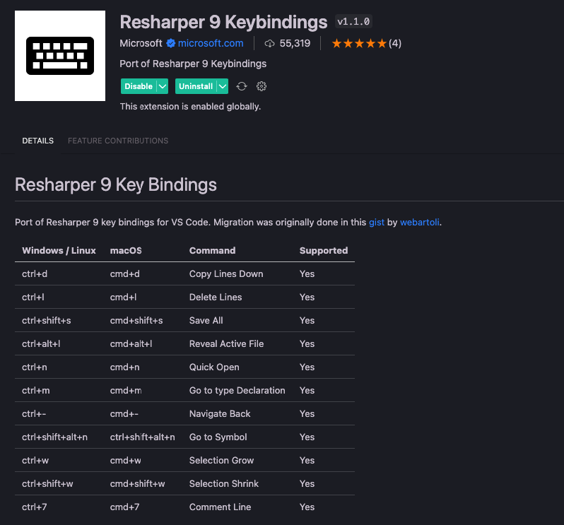
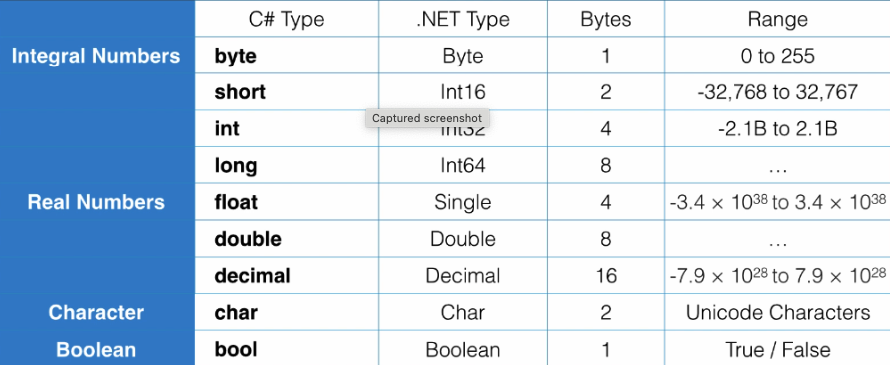

# How to run C# in Visual code
- Install your dotnet sdk, after you downlaod SDK you will get CLI as well
- Create your c# console application: dotnet new console -o yourAppName
- To Run your application use: dotnet run

# How to debug in Visual code
- Download the extension C# by microsoft
- command + p : .Net Generate and debug


- Then you can click on debug button

# WHat is CLR?
- CLR stands for Common Language Runtime
- CLR translate from IL (Intermidiate Language) code to Native code or machine code that can run on any machine
- When you complite your C# code -> IL code -> Native code
- When you compile an application, C# compiler compiles your code to IL (Intermediate Language) code. IL code is platform agnostics, which makes it possible to a take a C# program on a different computer with different hardware architecture and operating system and run it. For this to happen, we need CLR. When you run a C# application, CLR compiles the IL code into the native machine code for the computer on which it is running. This process is called Just-in-time Compilation (JIT).

# What is Namespace?
- NameSpace is a container for related classses
- One namespcae has many classes
- Assembly is a continaer of related namespace or A single unite of deployment of .NET application

# C# vs .NET
- C# is a programming language, while .NET is a framework. It consists of a run-time environment (CLR) and a class library that we use for building applications.

# Resharper
- Resharper is a tool that helps you to write clean code


# Variable and Constants
- Variable: a name given to a storage location in memory
- Constant (const): an immutable value

# Namgin Conventions
- Camel Case: firstName
- Pascal Case: FirstName
- Hungarian Notation: strFirstName
- For local variables: Camel Case , like int number;
- For constants: const int MaxZoom = 5;

# Primitive Types


# Non-Primitive Types
- String, Array, Enum and Class

# Enum
- Enum is a value type that represents a set of named constants. or a set of name/value pairs

# Nameing rule of Class
- Naming in C# we use Pascal Case. like public class Person {}
- Naming of the paramater we use Camel Case. like string fristName
```cs
public class Person {
  public string FirstName;
  public string LastName;

  public string GetFullName(){
    return $"{FirstName} {LastName}";
  }
}
```


